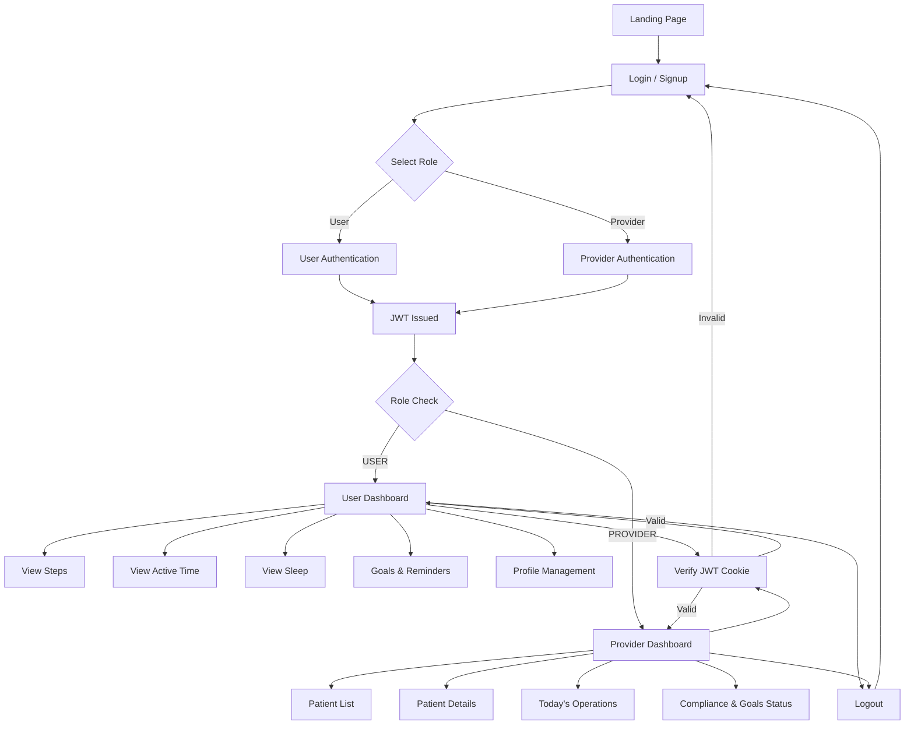

MediMonitor – Frontend Module 

This repository contains the frontend modules developed by Member 2 for the MediMonitor Healthcare Monitoring Platform during the hackathon.

My responsibility focused on building Patient & Provider Dashboards, routing, UI components, and role-based navigation using React.js.

## 🧭 System Workflow Diagram


Features Implemented
👤 Patient Module
1. Patient Dashboard

Displays daily health summary:

Steps

Active Time

Sleep

Shows dynamic health goals added by the user

Modern card-based UI

2. Goals Management

Users can add custom goals

Each goal has a name and target

Goals automatically appear on the dashboard

3. Patient Profile

Shows personal information

Displays next appointment details

Includes edit/reschedule buttons (UI level)

🩺 Provider Module
4. Provider Dashboard

Overview of:

Patient Status

Goals Met

Compliance

Clean, professional layout

5. Patients List

Displays all patients

Shows:

Status (Stable / Follow-up / Critical)

Goals progress

Next appointment date

6. Reports Section

Patient-wise reports

Shows:

Date

Status

Summary

Includes View & Download actions

🔀 Routing & Navigation

Implemented role-based routing:

Patient Routes

/patient → Dashboard

/patient/goals → Goals

/patient/profile → Profile

Provider Routes

/provider → Dashboard

/provider/patients → Patients

/provider/reports → Reports

Separate sidebars were created for:

Patients

Providers

Navigation is handled using React Router DOM.

🛠️ Tech Stack

Frontend: React.js

Routing: React Router DOM

Styling: CSS

Version Control: Git & GitHub

Workflow: Feature branch (member2) + Pull Request

📁 Project Structure (My Part)
src/
│
├── components/
│   ├── Sidebar.jsx
│   ├── ProviderSidebar.jsx
│   └── DashboardCard.jsx
│
├── pages/
│   ├── PatientDashboard.jsx
│   ├── PatientGoals.jsx
│   ├── PatientProfile.jsx
│   ├── ProviderDashboard.jsx
│   ├── ProviderPatients.jsx
│   └── ProviderReports.jsx
│
└── App.js

⚙️ How to Run
npm install
npm start


Open in browser:

http://localhost:3000

🔧 Git Workflow Used

Worked on member2 branch

Pushed changes to my forked repository

Created Pull Request to merge into main

Followed professional Git collaboration workflow

## 🔐 Authentication & Authorization

This application uses **JWT-based authentication** with **role-based authorization** to securely manage access for different user types.

---

## 🧑‍💻 User Roles

The system supports two roles:

| Role | Description |
|------|------------|
| USER | End user / patient |
| PROVIDER | Healthcare provider |

Roles are stored in the database and embedded inside the JWT token.

---

## 🔑 Authentication Flow (JWT)

### Signup
1. User submits email, username, password, and role
2. Backend:
   - Validates input
   - Hashes password using bcrypt
   - Stores user with role in MongoDB
   - Generates JWT containing `{ userId, role }`
3. JWT is sent as an **HTTP-only cookie**

### Login
1. User submits email and password
2. Backend:
   - Verifies credentials
   - Generates JWT with role
   - Stores JWT in cookie
3. User is redirected based on role

---

## 🪪 JWT Structure

```json
{
  "id": "user_id",
  "user_name" : "username",
  "email" : "mail id",
  "role": "USER | PROVIDER",
  "Password" : "bcrypt hased password",
  "iat": 1710000000,
  "exp": 1710086400
}

